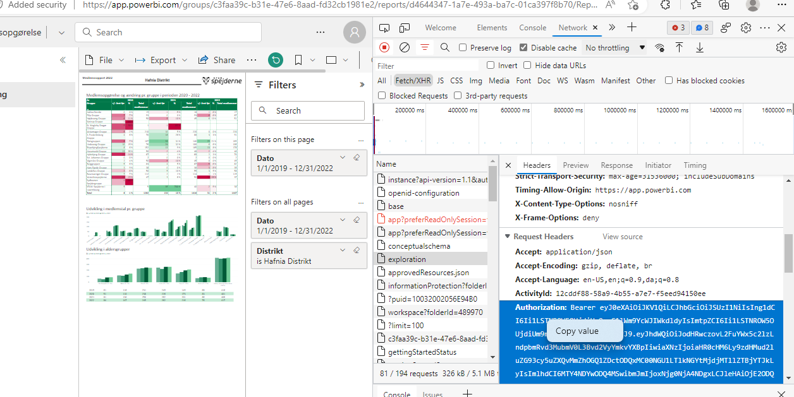

# Export af medlemsopgørelser

Det var nødvendigt med meget specifikke kald for de pågældende rapporter, så det er ikke særligt genbrugeligt.

Jeg har lavet "payload" mv. ved at kopiere selve forespørgslen i Developer Tools, så på den måde kan det nok lade sig gøre at lave noget tilsvarende for andre rapporter.

## Anvendelse

Find Bearer token i developer tools



I den aktuelle mappe skal ligge csv fil med hhv. grupper eller distrikter. Vær opmærksom på, at filen er gemt med UTF8 encoding.

Man angive om det skal være grupper eller distrikter med switches. 

```powershell
scripts/data> ../src/Export-PowerBiReports.ps1 -Grupper -BearerToken "Bearer eyJ0...bla.bla.bla.bla...."
```
